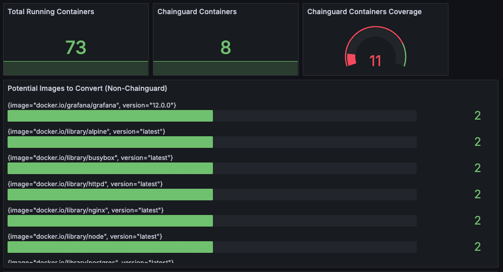
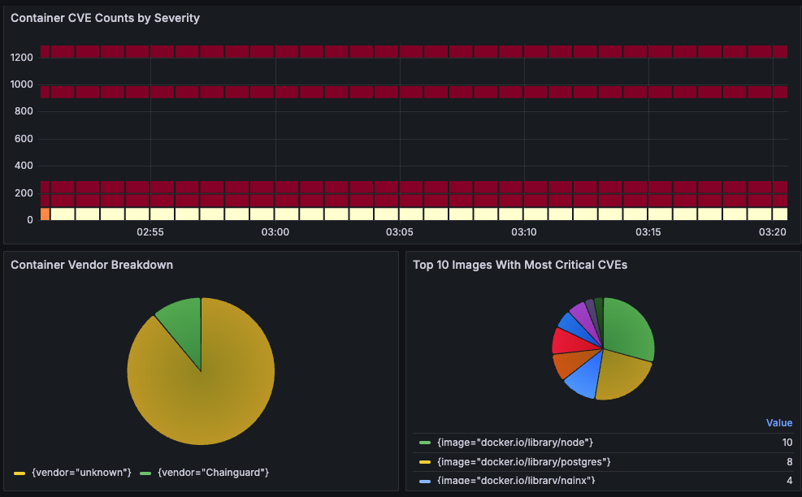

# container-security-dashboard

Dashboards and metrics collector for tracking Chainguard image usage across your Kubernetes cluster.

This tool is designed to **help you understand adoption of Chainguard container images** for enhanced supply chain security. It works by scanning local images on every node and exporting metrics in a Prometheus/OpenMetrics-friendly format, as well as (optionally) CSV for reporting or integrations.





&#x20;&#x20;

---

## Quick Start

### Prerequisites

* Kubernetes cluster using **containerd** (e.g., Kubeadm, K3s, K0s)
* [Prometheus Node Exporter](https://github.com/prometheus/node_exporter) (recommended for easiest integration)
* [Kube-Prometheus Stack](https://github.com/prometheus-community/helm-charts/tree/main/charts/kube-prometheus-stack) and [Grafana](https://grafana.com/)
* `chainctl` access and a valid identity for your Chainguard organization

### 1. Install Kube-Prometheus Stack

```bash
helm repo add prometheus-community https://prometheus-community.github.io/helm-charts
helm repo update
kubectl create namespace monitoring
helm upgrade --install kps prometheus-community/kube-prometheus-stack --namespace monitoring -f helmvalues.yaml
```

### 2. Install Container Security Dashboard Metrics Collector

```bash
kubectl apply -f kubernetes-manifest.yaml
```

---

**If deploying on multiple clusters:**
Set a unique cluster name for each deployment by editing the `cluster-name` ConfigMap in your manifests before deploying. For example:

```yaml
apiVersion: v1
kind: ConfigMap
metadata:
  name: cluster-name
  namespace: monitoring
data:
  CLUSTER_NAME: my-unique-cluster-name
```

The deployment references this value:

```yaml
- name: CLUSTER_NAME
  valueFrom:
    configMapKeyRef:
      name: cluster-name
      key: CLUSTER_NAME
```

Be sure to set a unique value for `CLUSTER_NAME` in each cluster’s `ConfigMap` for correct attribution in metrics and dashboards.

---

> **Note:**
> This script is designed primarily for **Kubernetes clusters using containerd** as the container runtime.
> It will not work with Docker-based Kubernetes nodes or CRI-O clusters.

---

## How it works

* Scans images on each node using `crictl`.
* Distinguishes Chainguard vs. non-Chainguard images (using image metadata and a digest cache).
* Exports adoption metrics in a format compatible with Prometheus Node Exporter (default) or as an OpenMetrics endpoint for other monitoring platforms.

---

## Integration & Modes

### 1. **Default Mode (Node Exporter integration)**

By default, the script writes metrics to `/var/lib/node_exporter/textfile_collector` for easy pickup by [Prometheus Node Exporter](https://github.com/prometheus/node_exporter).

**This is the easiest and recommended setup** if you already use Kube-Prometheus.

### 2. **OpenMetrics Endpoint (Dynatrace, custom Prometheus scrape)**

The collector can also run in "OpenMetrics" mode, serving metrics directly on an HTTP port. This is ideal if:

* You do NOT use Prometheus Node Exporter, or
* You want to scrape metrics directly (e.g., for Dynatrace or other custom setups).

**How to enable:**

* Uncomment the Prometheus scrape annotations and the relevant environment variables in your DaemonSet:

  ```yaml
  annotations:
    prometheus.io/scrape: "true"
    prometheus.io/port:   "9090"
  ```
* Set these environment variables in the collector:

  ```yaml
  - name: HTTP_PORT
    value: "9090"
  - name: OPENMETRICS
    value: "TRUE"
  ```

---

## CSV Mode (for reporting or integrations)

You can also run the collector in **CSV mode** to output regular adoption reports, which is ideal for offline processing or feeding into custom BI/reporting systems.

* To use CSV mode, set the `WRITE_CSV` environment variable to `TRUE` and specify the desired output path.
* This can be run as a **Kubernetes CronJob** or a standalone cron task on any node.

### Example: Run as a Local Linux CronJob using Docker

You can run the collector as a local cron job on any Linux node (outside Kubernetes) using Docker. For example, to run every hour and write CSV reports to `/var/lib/container-security-csv`:

```cron
0 * * * * docker run --rm \
  -u 0 \
  -v /var/lib/container-security-csv:/data \
  -v /run/containerd/containerd.sock:/run/containerd/containerd.sock \
  -v /var/run/chainguard/oidc:/var/run/chainguard/oidc:ro \
  -v /var/tmp:/tmp \
  -e WRITE_CSV=TRUE \
  -e OUTPUT_FILE=/data/adoption.csv \
  -e CHAINCTL_IDENTITY='<your-identity-string>' \
  -e CLUSTER_NAME='<your-cluster-name>' \
  -e HOSTNODE_NAME="$(hostname)" \
  ghcr.io/wkonitzer/container-security-dashboard:latest
```

To rotate the CSV file daily:

```cron
59 23 * * * mv /var/lib/container-security-csv/adoption.csv /var/lib/container-security-csv/adoption-$(date +\%Y-\%m-\%d).csv 2>/dev/null || true
```

Replace `<your-identity-string>` and `<your-cluster-name>` with your actual values. Make sure your host's `/run/containerd/containerd.sock` and `/var/run/chainguard/oidc/oidc-token` are available and readable by Docker (run as root if needed).

---

#### How to Get a ServiceAccount Token for Docker/Cron Jobs

If you are running the collector outside Kubernetes (e.g., in a Linux cron job via Docker), you need an OIDC token for your ServiceAccount. You can generate one on demand with:

```sh
kubectl create token chainctl -n monitoring --duration=3600s --audience=issuer.enforce.dev > /var/run/chainguard/oidc/oidc-token
```

* This creates a valid token for the `chainctl` ServiceAccount in the `monitoring` namespace, valid for one hour.
* Make sure the output directory exists:

  ```sh
  sudo mkdir -p /var/run/chainguard/oidc
  ```
* Use this token in your Docker run command as shown above.

---

### Alternatively: Use a Long-Lived Pull Token

If you prefer not to rely on Kubernetes tokens or need a longer-lived credential, you can **create a long-lived pull token (e.g., 1 year)** via the [Chainguard Console](https://console.enforce.dev):

1. **Go to the Chainguard Console** and navigate to *Pull Tokens*.
2. **Create a new pull token** and set the desired expiration (for example, 1 year).
3. The console will provide you:
   - **Username** (e.g., `a5246ba546c6364dfd5606c4381e4a378c87b7ff/8144e5885fef9585`)
   - **Password** (the secret token value)

**To use these with `chainctl`:**

Copy the Password into `/var/run/chainguard/oidc/oidc-token` and set `CHAINCTL_IDENTITY=<Username>` in the docker run command above.

**Summary:**  
You may either automate ServiceAccount token creation with `kubectl` (as above), **or** use a long-lived pull token from the Chainguard Console by setting `CHAINCTL_IDENTITY` to the User ID and putting the password in `/var/run/chainguard/oidc/oidc-token`.

---

## Authentication: Setting up CHAINCTL_IDENTITY

**IMPORTANT:**  
You **must** update the `CHAINCTL_IDENTITY` value in the Kubernetes Secret to match your organization and cluster.

### Steps to Create a Chainctl Identity

1. **Create a new identity** for your cluster using the `chainctl` CLI.
2. You will need the issuer URL and the JWKS public key for your Kubernetes API server.

#### Example:

```sh
# Get JWKS from the API server
kubectl get --raw /openid/v1/jwks
```

### How to determine the correct `--identity-issuer` value (Practical example)

To ensure your Chainguard identity works, you must use the correct issuer URL for your Kubernetes cluster.  
This is typically:

```
https://kubernetes.default.svc.cluster.local
```

**To confirm with a practical example:**

1. Find the name of a running pod that uses your ServiceAccount (e.g., from your DaemonSet):
   ```sh
   kubectl -n monitoring get pods
   ```
   (Look for the pod from the `container-security-metrics` DaemonSet or any other relevant workload.)

2. Open a shell in that pod:
   ```sh
   kubectl -n monitoring exec -it <your-pod-name> -- /bin/sh
   ```

3. Print the contents of the projected token:
   ```sh
   cat /var/run/chainguard/oidc/oidc-token
   ```

4. Decode the JWT token payload to inspect the issuer (`iss`):
   ```sh
   cat /var/run/chainguard/oidc/oidc-token | cut -d. -f2 | base64 -d | jq .
   ```
   The output will look something like this:
   ```json
   {
     "iss": "https://kubernetes.default.svc.cluster.local",
     ...
   }
   ```

5. Use the `iss` value as your `--identity-issuer` for `chainctl iam identities create`.

> ⚠️ **Note:**  
> The JWKS endpoint (`kubectl get --raw /openid/v1/jwks`) provides public keys only and does *not* include the issuer URL. Always confirm using a token as shown above.

Now create an identity:

```sh
chainctl iam identities create kube-cluster   --identity-issuer=https://kubernetes.default.svc.cluster.local   --issuer-keys='<PASTE YOUR JWKS JSON HERE>'   --subject=system:serviceaccount:monitoring:chainctl   --role=registry.pull   --parent=your-org
```

- The output will contain the identity string.  
- Update the `CHAINCTL_IDENTITY` in the Secret of the Kubernetes manifest:
    ```yaml
    apiVersion: v1
    kind: Secret
    metadata:
      name: chainctl-identity
      namespace: monitoring
    type: Opaque
    stringData:
      CHAINCTL_IDENTITY: <YOUR_NEW_IDENTITY>
    ```

---

## Accessing Dashboards

**Grafana:**  
```sh
kubectl --namespace monitoring port-forward svc/kps-grafana 3000:80
````

Then open [http://localhost:3000](http://localhost:3000)

Default username: `admin`
Password:

```sh
kubectl get secret --namespace monitoring kps-grafana -o jsonpath="{.data.admin-password}" | base64 --decode ; echo
```

**Prometheus:**

```sh
kubectl --namespace monitoring port-forward svc/kps-kube-prometheus-stack-prometheus 9090:9090
```

Then open [http://localhost:9090](http://localhost:9090)

**Grafana Dashboard Import:**
Import `container-security-dashboard.json` for pre-built visualizations.

---

## Notes & Troubleshooting

* The script is **containerd-specific**. It does **not** support Docker or CRI-O.
* **Prometheus Node Exporter** is strongly recommended for easiest setup.
  If you want to use OpenMetrics instead (e.g., for Dynatrace), set `OPENMETRICS=TRUE` and `HTTP_PORT`.
* You may need to adjust permissions or volumes for `/var/lib/node_exporter/textfile_collector` or your CSV output directory.
* If running as a CronJob, ensure the job has access to containerd and to the location where you want to write CSV files.

---

## Support

Open an issue or pull request if you have improvements or find bugs!
