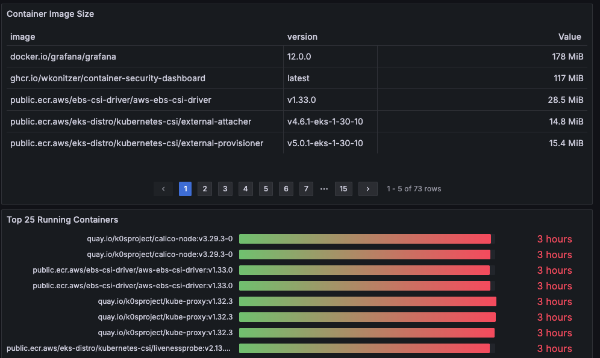

# container-security-dashboard
Dashboards for Chainguard images usage.

A simple tool that runs inside your Kubernetes cluster to see Chainguard image usage. Example screenshots below. Depends on Prometheus, Prometheus Node Exporter, and Grafana, i.e. the typical Kube-Prometheus stack.




**Quick Start: Install via Helm and Kubectl**

1. Add the Prometheus Community Helm repo:
```
helm repo add prometheus-community https://prometheus-community.github.io/helm-charts
helm repo update
```
2. Create the monitoring namespace:
```
kubectl create namespace monitoring
```
3. Install Kube-Prometheus Stack:
```
helm upgrade --install kps prometheus-community/kube-prometheus-stack --namespace monitoring -f helmvalues.yaml
```

**Install Container Security Dashboard Metrics Collector**
```
kubectl apply -f kubernetes-manifest.yaml
```

Import container-security-dashboard.json into Grafana for dashboards

**Access Grafana and Prometheus UIs**

Grafana:
By default, it’s only accessible inside the cluster. To access it locally:
```
kubectl --namespace monitoring port-forward svc/kps-grafana 3000:80
```
Then open http://localhost:3000
Default username: admin
Password: Get with:
```
kubectl get secret --namespace monitoring kps-grafana -o jsonpath="{.data.admin-password}" | base64 --decode ; echo
```
Prometheus:
```
kubectl --namespace monitoring port-forward svc/kps-kube-prometheus-stack-prometheus 9090:9090
```
Visit http://localhost:9090
